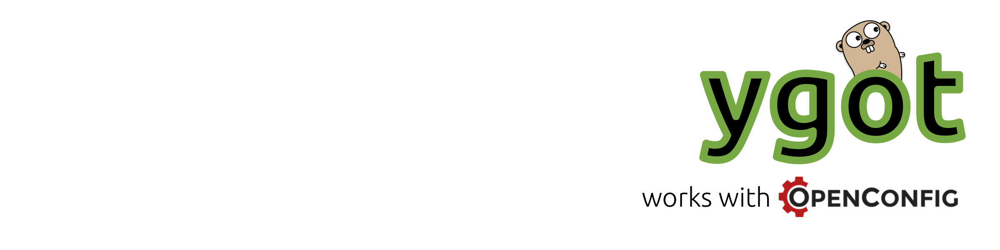

[](https://travis-ci.org/openconfig/ygot)
[](https://coveralls.io/github/openconfig/ygot?branch=master)



## Introduction
ygot (**Y**ANG **Go** **T**ools) is a collection of Go utilities that can be used to:

 * Generate a set of Go structures and enumerated values for a set of YANG modules, with associated helper methods.
 * Validate the contents of the Go structures against the YANG schema (e.g., validating range and regular expression constraints).
 * Render the Go structures to an output format - such as JSON, or a set of gNMI Notifications for use in a deployment of streaming telemetry.

Whilst ygot is designed to work with any YANG module, for OpenConfig modules, it can provide transformations of the schema to optimise the data structures that are produced for use in systems that generate data instances of the models for configuration purposes. These helper methods require that the OpenConfig [style guide](https://github.com/openconfig/public/blob/master/doc/openconfig_style_guide.md) patterns are implemented, a model can be verified to conform with these requirements using the [OpenConfig linter](https://github.com/openconfig/oc-pyang).

**Note**: This is not an official Google product.

## Getting Started with ygot

`ygot` consists of a number of parts, `generator` which is a binary using the `ygen` library to generate Go code from a set of YANG modules. `ygot` which provides helper methods for the `ygen`-produced structs - for example, rendering to JSON, or gNMI notifications - and `ytypes` which provides validation of the contents of `ygen` structs against the YANG schema. 

The basic workflow for working with `ygot` is as follows:

 * Generate Go code from a set of YANG files.
 * Write code that populates the Go structures.
 * Validate the contents of the Go structures.
 * Output the contents of the structures as JSON or gNMI Notifications.

The `demo/getting_started` directory walks through this process for a simple implementation of `openconfig-interfaces`.

### Generating Go Structures from YANG

The generator binary takes a set of YANG modules as input and outputs generated code. For example:

```
generator -output_file=<outputpath> -package_name=<pkg> [yangfiles]
```

Will output generated Go code for `yangfiles` (a space separated list of YANG files) to a file at `<outputpath>` with the Go package named `<pkg>`. 

Most YANG modules include other modules. If these included modules are not within the current working directory, the `path` argument is used. The argument to `path` is a comma-separated list of directories which will be recursively searched for included files.

By default, `ygot` does not output an entity for the root of the schema tree - such that there is not a root entity to consider in code. If one is desired then it can be produced by using the `generate_fakeroot` argument. If specified an element with the name specified by `fakeroot_name` will be created in the output code. By default the fake root element is called `device`, since the root is often considered to be a device within the OpenConfig use case.

If schema transformations for OpenConfig are desired, these are enabled using the `compress_paths` argument.

Putting this all together, a command line to generate OpenConfig interfaces from the contents of the `demo/getting_started/yang` directory is:

```
go run $GOPATH/src/github.com/openconfig/ygot/generator/generator.go -path=yang -output_file=pkg/ocdemo/oc.go -package_name=ocdemo -generate_fakeroot -fakeroot_name=device -compress_paths=true  -exclude_modules=ietf-interfaces yang/openconfig-interfaces.yang
```

To allow this file to be auto-created, you can place a command which allows this code generation to be done automatically, either by creating a file within the YANG directory, or directly embedding this command within the source file that populates the structures. For an example, see the `demo/getting_started/main.go` file which includes:

```
//go:generate go run ../../generator/generator.go -path=yang -output_file=pkg/ocdemo/oc.go -package_name=ocdemo -generate_fakeroot -fakeroot_name=device -compress_paths=true  -exclude_modules=ietf-interfaces yang/openconfig-interfaces.yang
```

This means that we can simply type `go generate` within `demo/getting_started` - and the `demo/getting_started/pkg/ocdemo/oc.go` is created with the code bindings for the OpenConfig interfaces module.

### Writing Code that Populates the Go Structures

Once we have generated the Go bindings for the YANG module, we're ready to use them in an application.

First, let's take a look at what the `demo/getting_started/pkg/ocdemo/oc.go` file contains. Particularly, looking at the fake root entity that we created (named device):

```go
// Device represents the /device YANG schema element.
type Device struct {
        Interface       map[string]*Interface   `path:"interfaces/interface" rootname:"interface" module:"openconfig-interfaces"`
}
```

Since we enabled `compress_paths`, then the `/interfaces/interface` element in OpenConfig was represented as `Interface` at the root (called `Device`). We can see that since `interface` is a list, keyed by the `name` element, then the `Interface` map is keyed by a string.

Looking further down the tree at `Interface`:

```go
// Interface represents the /openconfig-interfaces/interfaces/interface YANG schema element.
type Interface struct {
        AdminStatus  E_OpenconfigInterfaces_Interface_AdminStatus `path:"state/admin-status" module:"openconfig-interfaces"`
        Counters     *Interface_Counters                          `path:"state/counters" module:"openconfig-interfaces"`
        Description  *string                                      `path:"config/description" module:"openconfig-interfaces"`
        Enabled      *bool                                        `path:"config/enabled" module:"openconfig-interfaces"`
        HoldTime     *Interface_HoldTime                          `path:"hold-time" module:"openconfig-interfaces"`
        Ifindex      *uint32                                      `path:"state/ifindex" module:"openconfig-interfaces"`
        LastChange   *uint32                                      `path:"state/last-change" module:"openconfig-interfaces"`
        Mtu          *uint16                                      `path:"config/mtu" module:"openconfig-interfaces"`
        Name         *string                                      `path:"config/name|name" module:"openconfig-interfaces"`
        OperStatus   E_OpenconfigInterfaces_Interface_AdminStatus `path:"state/oper-status" module:"openconfig-interfaces"`
        Subinterface map[uint32]*Interface_Subinterface           `path:"subinterfaces/subinterface" module:"openconfig-interfaces"`
        Type         E_IETFInterfaces_InterfaceType               `path:"config/type" module:"openconfig-interfaces"`
}
```

Since OpenConfig path compression was enabled, then this `Interface` struct contains both direct descendants of `/interfaces/interface` - such as `hold-time` (in the `Hold-Time` field), along with those that were within the `config` and `state` fields. The path information is retained in the `path` struct tag -- but this isn't of interest to most developers working directly with the structs!

We can populate an interface by using a mixture of the helper methods, and directly setting fields of the struct. To create a new interface within the device, we can use the `NewInterface` method. A `New...` method is created for all lists within the YANG schema, and takes an argument of the key that is used for the list. It creates a new entry in the map with the specified key, returning an error if the key is already defined.

An example is shown below:

```go
// Create a new interface called "eth0"
i, err := d.NewInterface("eth0")

// Set the fields that are within the struct.
i.AdminStatus = oc.OpenconfigInterfaces_Interface_AdminStatus_UP
i.Mtu = ygot.Uint16(1500)
i.Description = ygot.String("An Interface")
```

The `ygot` package provides helpers that allow an input type to returned as a pointer to be populated within the structs. For example, `ygot.String` returns a string pointer to the argument supplied.

Equally, we can define a new interface directly and add it to the map, without using the `NewInterface` method:

```go
d.Interface["eth1"] = &oc.Interface{
	Name:        ygot.String("eth1"),
	Description: ygot.String("Another Interface"),
	Enabled:     ygot.Bool(false),
	Type:        oc.IETFInterfaces_InterfaceType_ethernetCsmacd,
}
```

### Validating the Struct Contents

For some fields of the structures, enumerated values for example, values of fields are restricted such that they cannot have invalid values specified. In other cases, such as an IPv4 addresses, a string may not match a regular expression, but the Go structure does not restrict the contents of the struct being populated with this data.

By default each struct has a `Validate` method, this can be used to validate the struct's contents against the schema. `Validate` can be called against each structure, for example:

```go
if err := d.Interface["eth0"].Validate(); err != nil {
	panic(fmt.Sprintf("Interface validation failed: %v", err))
}
```

In the case that the struct does not contain valid contents, `Validate` returns an error, containing a list of errors encountered during validation of the struct contents. Whilst the error can be directly handled as a comma-separated list of strings containing validation errors, casting it to the `ytypes.Errors` type allows handling of individual errors more cleanly. For example:

```go
_, err = subif.Ipv4.NewAddress("Not a valid address")
if err := invalidIf.Validate(); err == nil {
	panic(fmt.Sprintf("Did not find invalid address, got nil err: %v", err))
} else {
	errs := err.(ytypes.Errors)
	for _, err := range errs {
		fmt.Printf("Got expected error: %v\n", err)	}
}
```

### Outputting JSON from GoStructs

To serialise the structures to JSON, the `ygot` package provides an `EmitJSON` method which can be called with an arbitrary structure. In the example below, the fake root (`Device`) struct is called:

```go
json, err := ygot.EmitJSON(d, &ygot.EmitJSONConfig{
	Format: ygot.RFC7951,
	Indent: "  ",
	RFC7951Config: &ygot.RFC7951JSONConfig{
		AppendModuleName: true,
 	},
})

if err != nil {
	panic(fmt.Sprintf("JSON demo error: %v", err))
}
fmt.Println(json)
```

`EmitJSON` performs both `Validate` and outputs the structure to JSON. The format can be an internal JSON format, or that described by RFC7951. Validation or JSON marshalling errors are directly returned.

### Unmarshalling JSON to a GoStruct

ygot includes a function to unmarshal data from RFC7951-encoded JSON to a GoStruct. Since this function relies on the schema of the generated code, it us output within the generated code package - and named `Unmarshal`. The function takes an argument of a `[]byte` (byte slice) containing the JSON document to be unmarshalled, and a pointer to the struct into which it should be unmarshalled. Any struct can be unmarshalled into. If data cannot be unmarshalled, an error is returned.

To unmarshal the example created in this guide, we call `Unmarshal` with the `oc.Device` struct pointer, and the JSON document:

```go
// Device struct to unmarshal into.
loadd := &oc.Device{}
if err := oc.Unmarshal([]byte(json), loadd); err != nil {
  panic(fmt.Sprintf("Cannot unmarshal JSON: %v", err))
}
```

Currently, only the `RFC7951` format of JSON is supported for unmarshalling, the `Internal` format supported by ygot is not yet supported.

## For Developers
 * [Contributing](CONTRIBUTING.md) - how to contribute to ygot.
 * [Contributors](docs/CONTRIBUTORS.md) - Folks who have contributed to ygot, thanks very much!
 * [Design Choices](docs/design.md) - This document provides information pertaining
   to design choices made within the library itself; and should be reviewed in
   conjunction with the comments in the library code.


## Licensing

```
Copyright 2017 Google Inc.

Licensed under the Apache License, Version 2.0 (the "License");
you may not use this file except in compliance with the License.
You may obtain a copy of the License at

    http://www.apache.org/licenses/LICENSE-2.0

Unless required by applicable law or agreed to in writing, software
distributed under the License is distributed on an "AS IS" BASIS,
WITHOUT WARRANTIES OR CONDITIONS OF ANY KIND, either express or implied.
See the License for the specific language governing permissions and
limitations under the License.
```
